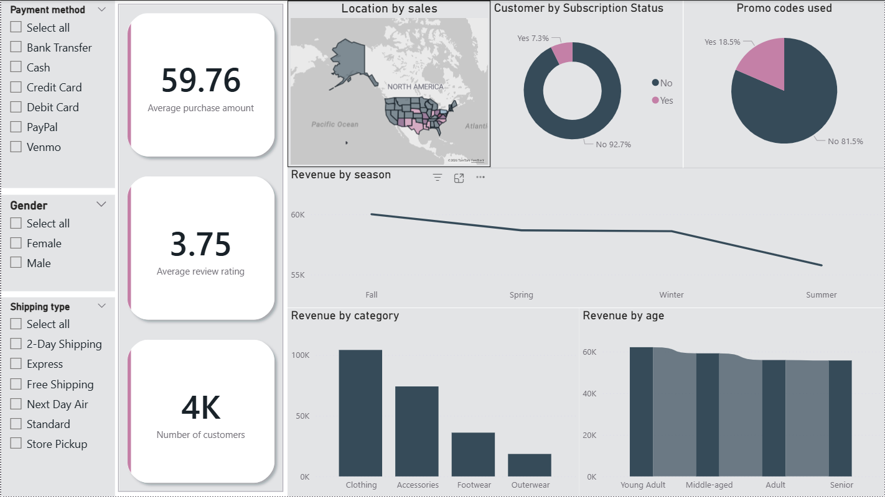

# 📊 Sales Dashboard – Power BI Project

## 📌 Overview
This project is an interactive **Customer behavior Dashboard built using Power BI**.  
The dashboard provides insights into sales performance, profit trends, and category distribution to help businesses make **data-driven decisions**.

## 🎯 Objectives
- Analyze overall sales performance
- Track profit trends
- Understand sales distribution by category
- Identify top performing products

## 📷 Dashboard Preview

## 📊 Key Metrics
The dashboard highlights the following KPIs:

- **Total Sales:** 438K  
- **Total Quantity Sold:** 5,615  
- **Total Profit:** 37K  

## 📈 Dashboard Features

### 1. Sales by Category
Shows how sales are distributed across product categories such as:
- Technology
- Furniture
- Office Supplies

### 2. Sales by Sub-Category
Breaks down sales into more detailed product groups.

### 3. Profit by Month
Displays monthly profit trends to identify profitable and weak periods.

### 4. Quantity by Category
Shows how many items were sold in each category.

## 🛠 Tools & Technologies
- **Power BI** – Data visualization & dashboard creation  
- **Excel / CSV Dataset** – Data source  
- **GitHub** – Project hosting and version control  
